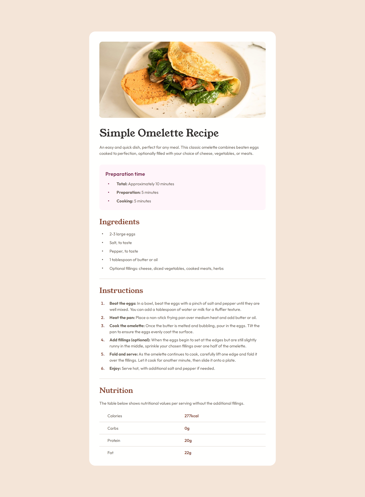
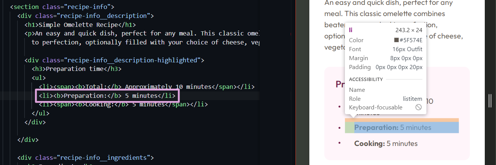
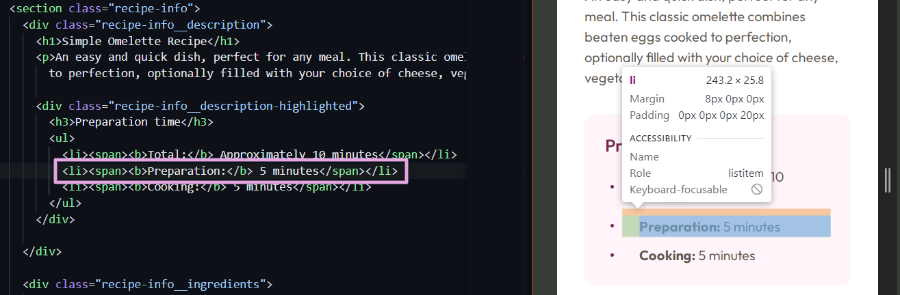
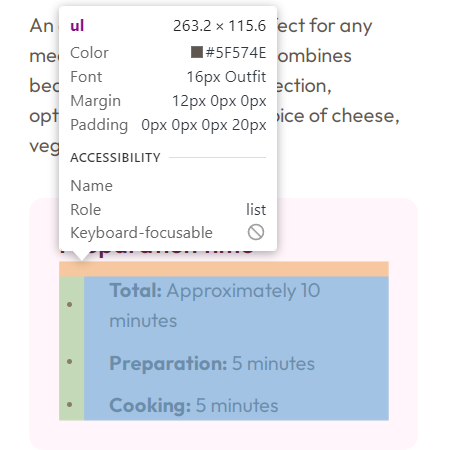
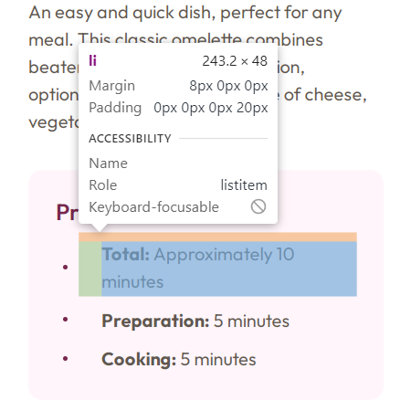
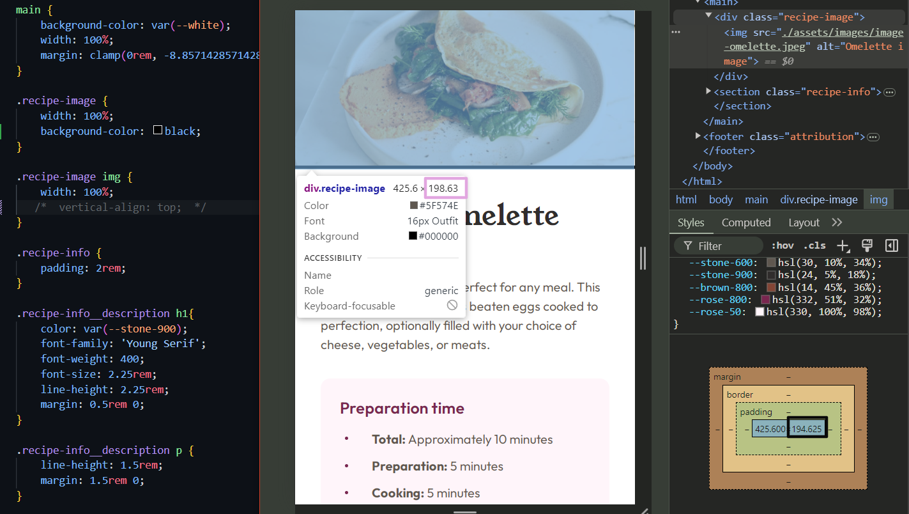
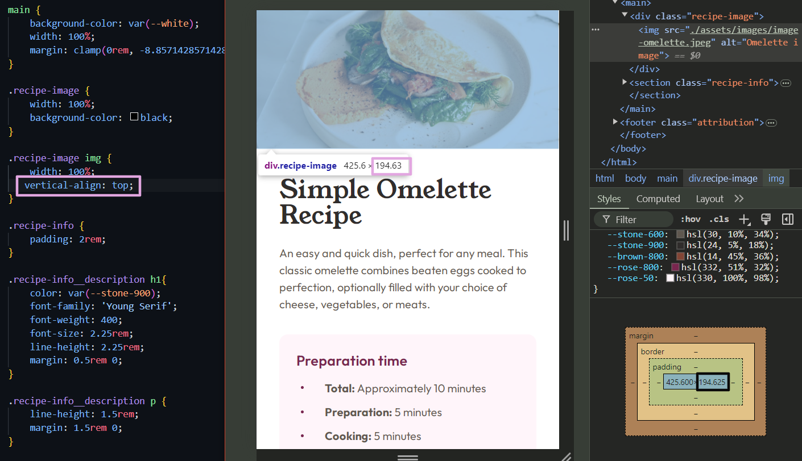

# Frontend Mentor - Recipe page solution

This is a solution to the [Recipe page challenge on Frontend Mentor](https://www.frontendmentor.io/challenges/recipe-page-KiTsR8QQKm). Frontend Mentor challenges help you improve your coding skills by building realistic projects. 

## Table of contents

- [Overview](#overview)
  - [The challenge](#the-challenge)
  - [Screenshot](#screenshot)
  - [Links](#links)
- [My process](#my-process)
  - [Built with](#built-with)
  - [What I learned](#what-i-learned)
  - [Useful resources](#useful-resources)
- [Author](#author)

## Overview

### Screenshot



### Links

- Solution URL: [Add solution URL here](https://your-solution-url.com)
- Live Site URL: [GitHub Pages](https://outstandinggirl13.github.io/recipe-page-main/)

## My process

### Built with

- Semantic HTML5 markup
- CSS custom properties
- Mobile-first design approach

### What I learned

At first, I didn’t expect this project to be tricky, but it turned out to be quite time-consuming. Two of the major challenges I faced were adjusting the padding/margin values to suit both mobile and desktop versions, and styling the bullet points in the lists.

The first issue was frustrating because the provided mobile and desktop designs had different margins, making it hard to replicate the design. I ended up with what feels like overloaded CSS, and despite my efforts to simplify it, I couldn’t achieve a result I was satisfied with. This experience taught me that consistency is crucial in design. It should be based on repeating and reusable elements to make development easier and faster.

The second challenge was an absolute hassle! I used a mobile-first approach, and in the mobile design, when horizontal screen space is limited, list items start to span multiple rows. The bullet points have to be vertically centered for these multi-line list items. Additionally, there were some whitespaces between the bullets and the text. After some research, I realized there’s no easy or convenient way to style list markers the way I wanted.

To fix the vertical alignment issue, I used an approach I found online:
1. I covered the `<li>` items with `<span>` tag
```html
  <ul>
    <li><span><b>Total:</b> Approximately 10 minutes</span></li>
  </ul>
```
2. Then changed display from inline to inline-block, so the align property will work
```css
  li > span {
      display: inline-block;
      vertical-align: middle;
  }
```
This works but slightly affects the list-item height (see screenshots below).


*(list item has height of 24px, as expected)*

*(height has changed to 25.4px)*

 I tried to resolve this strange behavior, but no success, so I left it as it is.

 Next, I could not resolve the whitespace issue elegantly, so I ended up applying two paddings - one to the `<ul>` / `<ol>` element to shift the markers from the left edge, and another directly to the list items to increase the distance between the text and bullet point:

 ```css
  .recipe-info__ingredients ul,
  .recipe-info__instructions ol {
      padding-left: 1.5rem;
  }

  .recipe-info__ingredients li,
  .recipe-info__instructions li {
      line-height: 1.5rem;
      margin: 0.5rem 0;
      padding-left: 1rem;
  }
 ```



Now that the frustrating part is over, I’d like to share some interesting CSS features I’ve learned:

1. The clamp() function is incredibly convenient! I didn’t know there was a way to set a value that smoothly adjusts within a defined range based on the viewport size. In this project, I used a clamp calculator (see the 'Useful Resources' section) to generate a clamp() function that dynamically adjusts the top and bottom margins. When the screen width is less than the `<main>` section (desktop), the margin is 0. As the width increases but stays under 1440px, the margin scales with the viewport size. Once the width hits 1440px or more, the margin has a fixed value:

```css
  main {
      margin: clamp(0rem, -8.857142857142856rem + 18.45238095238095vw, 7.75rem) auto;
  }
```

2. For a smooth transition between mobile and desktop versions, I used a media query, and for screens with widths bigger than 736px, I set a min-width of 736px. I also added a width of 50%, so on larger screens, the width of the main section expands slightly but still matches the design, taking up about 50% of the screen space.
```css
  @media (min-width: 48rem) {
    main {
        min-width: 46rem;
        width: 50%;
    }
  }
```
For reference, 50% of a 1440px screen is 720px, which is smaller than 736px, so the main section defaults to the min-width value and displays as intended based on the design.

3. When applying a width of 100% to an image inside a container (which is a block-level element), I encountered an issue: a small whitespace appeared below the image. It seems like the height of the image was set to 100%, but the container was slightly taller, leading to the whitespace at the bottom. (see the screenshot below—I added a black background to make it more visible).


*(for this screen configuration, the image height is 194.625px, while the container height is 198.63px)*

The issue is resolved by applying `vertical-align: top;` to the `` tag:



4. For me, it was not obvious that you can use `border-style: hidden;` on a table element, and it will make the outer borders disappear without affecting the inner borders of the table.

5. Pseudo-classes like `:first-of-type` and `:last-of-type` are incredibly useful when styling table rows.


### Useful resources

- [Get your bullets aligned](https://idkshite.com/posts/vertical-center-bullet) - This helped me align those tricky bullets vertically when single-line list items became multiline. I really liked this pattern and will use it going forward.
- [Custom bullets with CSS ::marker](https://web.dev/articles/css-marker-pseudo-element) - A great article that explains how to change bullet styles.
- [CSS: Control space between bullet and `<li>`](https://stackoverflow.com/questions/4373046/css-control-space-between-bullet-and-li) - Discussion on Stack Overflow about different methods to control how much horizontal space a bullet pushes its `<li>` to the right.
- [The Clamp Calculator](https://royalfig.github.io/fluid-typography-calculator/) - A handy resource for calculating clamp functions.

## Author

- Website - [Outstandinggirl13](https://github.com/Outstandinggirl13)
- Frontend Mentor - [@Outstandinggirl13](https://www.frontendmentor.io/profile/Outstandinggirl13)